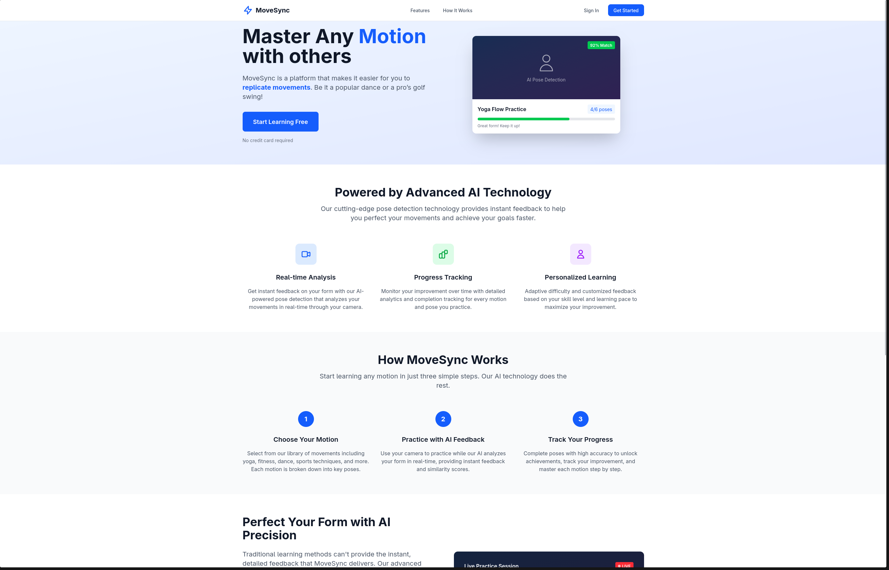

# MoveSync

MoveSync is a platform designed to help users easily replicate and master various movements, from popular dances to professional sports techniques. By leveraging advanced pose detection and intuitive visual feedback, MoveSync enables users to learn, practice, and perfect motions with real-time guidance.



## Features

- **Real-Time Pose Detection:** Accurately tracks and analyzes user movements using video input.
- **Visual Feedback:** Provides clear, interactive overlays to help users adjust and improve their form.
- **Learning Library:** Access a growing collection of motions, including dances, sports swings, and more.


## Getting Started

### Prerequisites

- [Node.js](https://nodejs.org/) (v16 or higher recommended)
- [Yarn](https://yarnpkg.com/) or [npm](https://www.npmjs.com/)

### Installation

1. Clone the repository:
    ```bash
    git clone https://github.com/matissjurevics/movesync.git
    cd movesync
    ```

2. Install dependencies:
    ```bash
    yarn install
    # or
    npm install
    ```

3. Start the development server:
    ```bash
    yarn dev
    # or
    npm run dev
    ```

4. Open your browser and navigate to `http://localhost:3000`.

## Usage

- Sign up or log in to your account.
- Select a motion to learn from the library.
- Allow camera access for pose detection.
- Follow the on-screen guidance to practice and improve your movement.

## Acknowledgements

- [TensorFlow.js](https://www.tensorflow.org/js) for pose estimation
- [Nuxt.js](https://nuxt.com/) for the application framework

